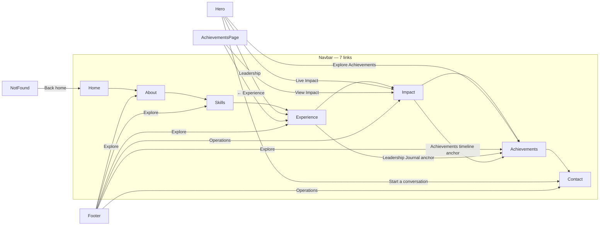

# Routing Map — Web Portfolio

> Base URL: `https://portfolio-muhammad-hafizh-maulidan.vercel.app`
> Router: `react-router-dom v7` — `src/App.jsx` (BrowserRouter, lazy + Suspense)
> Semua halaman prerender via `scripts/prerender.mjs` + `public/sitemap.xml`

## 1. Daftar Route Aktif

| Route | Component | File | Title (usePageMeta) | Prerender | Sitemap |
|-------|-----------|------|---------------------|-----------|---------|
| `/` | `Hero` | `src/components/Hero.jsx` | `Muhammad Hafizh Maulidan \| Operations & Production Leader` | ✅ | ✅ |
| `/about` | `About` | `src/components/About.jsx` | `About \| Muhammad Hafizh Maulidan` | ✅ | ✅ |
| `/skills` | `Skills` | `src/components/Skills.jsx` | `Skills \| Muhammad Hafizh Maulidan` | ✅ | ✅ |
| `/experience` | `Experience` | `src/components/Experience.jsx` | `Experience \| Muhammad Hafizh Maulidan` | ✅ | ✅ |
| `/impact` | `ProductionImpact` | `src/components/ProductionImpact.jsx` | `Production Impact \| Muhammad Hafizh Maulidan` | ✅ | ✅ |
| `/achievements` | `AchievementsPage` | `src/components/AchievementsPage.jsx` | `Achievements \| Muhammad Hafizh Maulidan` | ✅ | ✅ |
| `/certifications` | `Certifications` | `src/components/Certifications.jsx` | `Certifications \| Muhammad Hafizh Maulidan` | ✅ | ✅ |
| `/publications` | `Publications` | `src/components/Publications.jsx` | `Publications \| Muhammad Hafizh Maulidan` | ✅ | ✅ |
| `/contact` | `Contact` | `src/components/Contact.jsx` | `Contact \| Muhammad Hafizh Maulidan` | ✅ | ✅ |
| `/tubelight-demo` | `TubelightDemo` | `src/components/ui/tubelight-demo.tsx` | *(fallback `/`)* | ❌ (demo) | ❌ |
| `*` | `NotFound` | `src/components/NotFound.jsx` | `404` | ❌ | ❌ |

> **Hidden:** `/projects` — file `src/components/Projects.jsx` masih ada tapi **route dihapus** (`src/App.jsx:60` di-comment), tidak ada di `Navbar`, `sitemap.xml`, `prerender.mjs`, atau `usePageMeta`. Akses langsung `/projects` → `NotFound`.

## 2. Navigasi Utama

### Navbar `src/components/Navbar.jsx`
- **Desktop** (`hidden lg:flex`): Logo `Factory → /` + 7 links: `Home (/)`, `About`, `Skills`, `Experience`, `Impact`, `Achievements`, `Contact`
- **Mobile** (`lg:hidden`): Fluid Island pill `top-4` + hamburger morph → full-screen overlay `backdrop-blur-3xl` dengan 7 links yang sama + social
- **Social (both):** `https://github.com/hafizhmaulidan15` (external `_blank`), `https://www.linkedin.com/in/hafizhmaulidan/` (external)

### Footer `src/components/Footer.jsx`
- **Explore:** `About (/about)`, `Skills (/skills)`, `Experience (/experience)`, `Achievements (/achievements)` — *sebelumnya Projects → sekarang Achievements*
- **Operations:** `Impact (/impact)`, `Contact (/contact)`, `Achievements (/experience#leadership-journal)` dengan pulse dot
- **Contact:** `mailto:mhafizh.maulidan@gmail.com`, `tel:+6289603818819`, `Tasikmalaya / Bogor` (no link)
- **Social:** GitHub / LinkedIn same as Navbar
- **Bottom:** `©` + `Privacy (/#)` `Terms (/#)` (placeholder `#` — tidak navigasi)

## 3. Link yang Bisa Di-Klik per Halaman

### Hero `src/components/Hero.jsx`
- `Explore Achievements →` → `/achievements`
- `Leadership →` → `/experience`
- `Live Impact →` → `/impact`
- `Start a conversation` (pill) → `/contact`
- `View achievements` (underline) → `/achievements` (sebelumnya `/projects`)
- Stats `12 / 3 / 3` — non-klik

### AchievementsPage `src/components/AchievementsPage.jsx`
- `← Experience` → `/experience`
- `View Impact →` → `/impact`
- `Leadership Journal →` → `/experience#leadership-journal` (anchor)
- `Impact Achievements →` → `/impact#achievements-timeline` (anchor)
- `Impact Overview →` → `/impact`

### Other Pages
- **About, Skills, Experience, Impact, Certifications, Publications, Contact:** Tidak ada internal link utama selain via `Navbar`/`Footer`. `Experience` Leadership Journal cards punya `Related to: Pembuatan Mozzarela` (text, no link).
- **NotFound `src/components/NotFound.jsx`:** `Back home → /`
- **Tubelight Demo `src/components/ui/tubelight-demo.tsx`:** Demo pill nav `Home (/)`, `About (/about)`, `Achievements (/achievements)`, `Resume (/contact)` — isolated demo, tidak dipakai global.

### External Links (semua `_blank` + `rel="noopener noreferrer"`)
- `https://github.com/hafizhmaulidan15` — Navbar (2x), Footer, AchievementsPage, Contact peripheral
- `https://www.linkedin.com/in/hafizhmaulidan/` — Navbar (2x), Footer
- `mailto:` / `tel:` — Contact + Footer
- `https://picsum.photos/seed/...` — Hero, Projects (images, Unsplash stock, exist)

## 4. Peta Visual (Mermaid)



## 5. Checklist Audit

- [x] Tidak ada link ke `/projects` yang aktif di `src` (hanya `README.md:51` docs, tidak klikable)
- [x] Semua `to="/..."` di `src` mengarah ke route yang ada di `src/App.jsx:54-64`
- [x] `src/hooks/usePageMeta.js` & `scripts/prerender.mjs` sinkron — hapus `/projects`, tambah `/achievements`
- [x] `public/sitemap.xml` sinkron — ganti `/projects` → `/achievements`
- [x] `tests/e2e.spec.js` sinkron — `routes` array ganti `/projects` → `/achievements`
- [x] `index.html` JSON-LD `BreadcrumbList` posisi 5 ganti `Projects` → `Achievements`, `ItemList` id/name/url ganti ke `#achievements`
- [x] `NotFound` catch-all `*` untuk URL salah
- [x] `Skip to content` (`App.jsx:46` `href="#main-content"`) untuk a11y

## 6. Cara Cek Routing

```bash
npm run dev # http://localhost:5173
# Klik manual Navbar 7 links, Hero 4 links, Footer 7 links, AchievementsPage 3 links
# Atau Playwright:
npm run test # tests/e2e.spec.js 7 routes smoke + hero nav + no console errors
# Prerender check:
npm run build && ls dist/achievements dist/impact dist/experience
```
